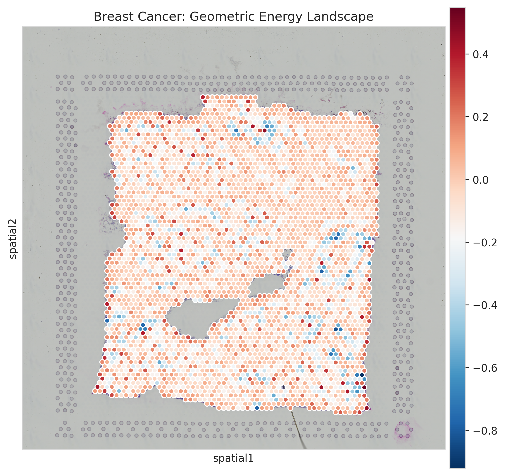
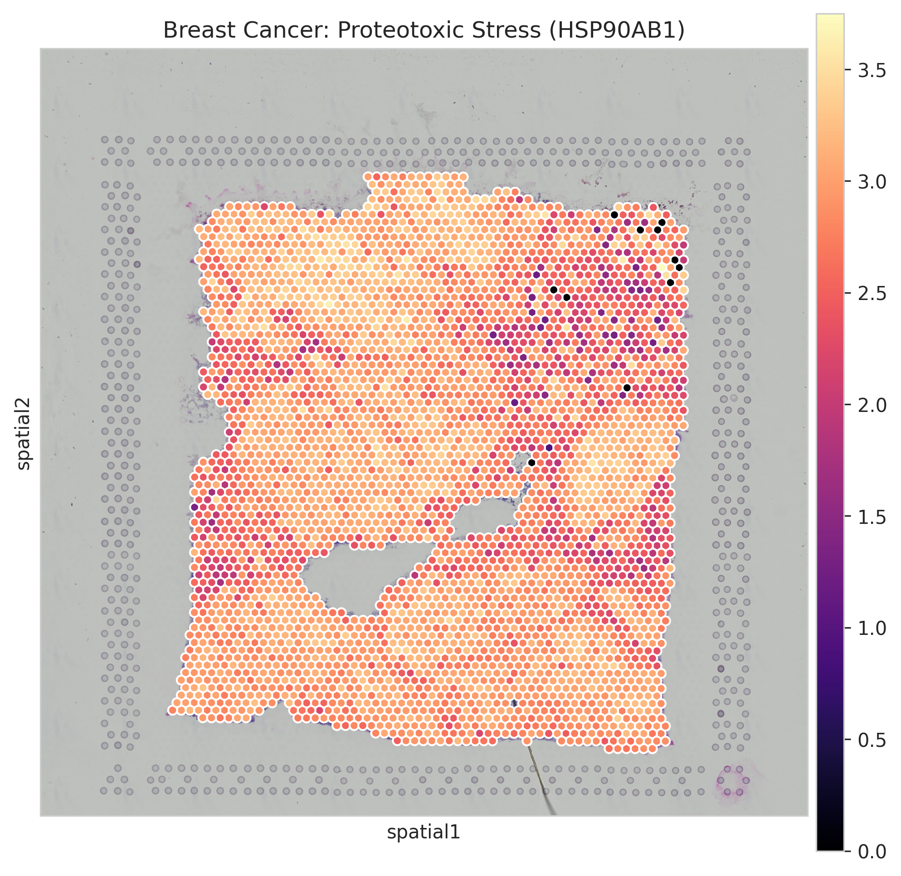
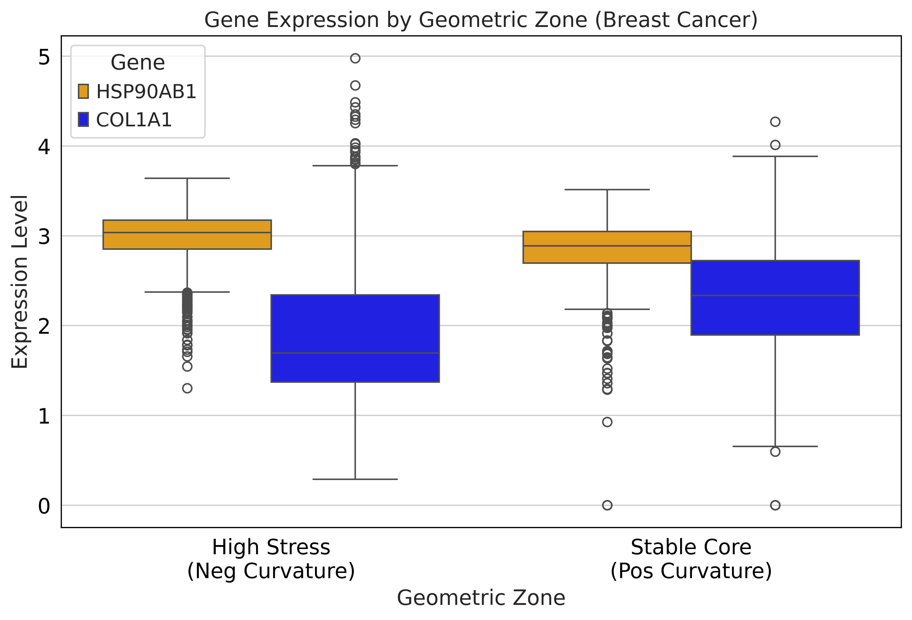
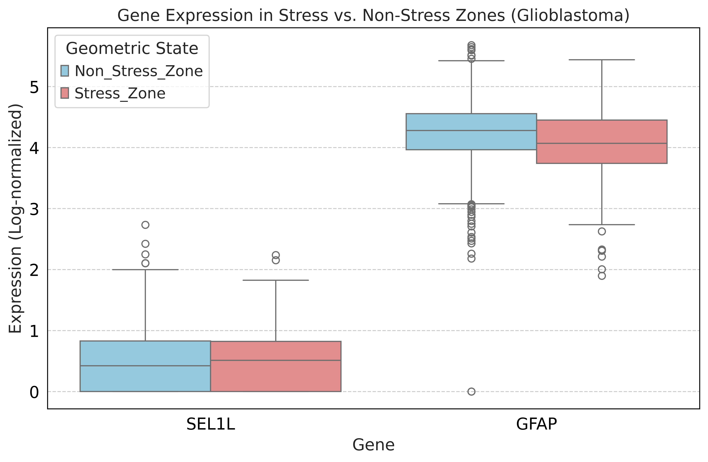

# Geometric Thermodynamics of the Tumor Microenvironment  
### Discrete Ricci Curvature Predicts Proteotoxic and ER Stress in Solid Tumors

---

## 🧬 Abstract

Tumor progression involves a transition from tissue homeostasis to a high-energy, spatially heterogeneous state characterized by mechanical, metabolic, and proteostatic stress. Although spatial transcriptomics provides cellular-resolution molecular maps, it lacks a **physical quantity** that captures tissue-level instability.

Here, we introduce a **geometry-based computational framework** that models the tumor microenvironment (TME) as a **gene-weighted discrete manifold**. By computing **Ollivier–Ricci Curvature (ORC)** on spatial transcriptomic graphs, we identify a **tissue-agnostic geometric signature of cellular stress**.

Across independent datasets:
- **Negative curvature (κ < 0)** robustly identifies regions of **thermodynamic instability and molecular stress**
- **Positive curvature (κ > 0)** corresponds to **structurally stable tissue domains**

Importantly, while the **geometric stress signature is conserved**, the **molecular stress response adapts to tissue context**, demonstrating that curvature functions as a higher-order physical biomarker rather than a gene-specific signal.

---

## 🔬 Graphical Abstract

Spatial transcriptomics spots are converted into a **functional spatial graph**, where edge weights encode gene-expression similarity.  
Ollivier–Ricci curvature is computed using optimal transport, producing a scalar measure of **local geometric stability**.

- **κ < 0** → topological bottlenecks → high molecular stress  
- **κ > 0** → redundant connectivity → structural stability  

This geometric signal generalizes across tumor types while revealing tissue-specific biology.

---

## Conceptual Framework: Geometry as a Physical Biomarker

Tumors are not merely collections of dysregulated cells; they are **non-equilibrium physical systems** whose spatial organization reflects underlying energetic constraints.

Ollivier–Ricci curvature quantifies how efficiently information and mass can be transported across a network:

- **Positive curvature** indicates locally redundant, tightly connected neighborhoods  
  → mechanically stable or fibrotic tissue

- **Negative curvature** indicates transport bottlenecks and geometric fragility  
  → invasive fronts and regions of proteostatic or ER stress

Crucially, curvature is computed **without biological labels**, allowing physical instability to be inferred *prior* to molecular interpretation.

---

## 📊 Key Results

### 1. Discovery Cohort: Breast Cancer

**Dataset:**  
10x Genomics Visium – Human Breast Cancer

#### Geometric Phase Separation

The tumor microenvironment segregates into:
- **Stable basins (κ > 0)**
- **Unstable fault lines (κ < 0)**

#### Negative Curvature Identifies Proteotoxic Stress

Regions of negative curvature show strong enrichment of:
- **HSP90AB1** – molecular chaperone, proteotoxic stress
- **XBP1** – unfolded protein response regulator

Statistical validation confirms significant upregulation in κ < 0 zones.

#### Positive Curvature Corresponds to Structural Rigidity

Positive curvature regions are enriched for extracellular matrix genes:
- **COL1A1** – collagen, fibrotic stiffness

---

### 2. Validation Cohort: Glioblastoma Multiforme (GBM)

**Dataset:**  
10x Genomics Visium – Human Glioblastoma

The identical geometric pipeline was applied **without modification**.

#### Conserved Geometry, Tissue-Specific Biology

- **Negative curvature** → **ER stress**
  - Marker: **SEL1L** (ER-associated degradation)
- **Positive curvature** → **astrocytic structural core**
  - Marker: **GFAP**

Statistical validation confirms SEL1L enrichment in stress zones.

---

## Biological Interpretation

Although breast cancer and glioblastoma activate **distinct stress pathways**, both tumors exhibit the **same geometric instability signature**.

This demonstrates that:
- Curvature captures a **physical property of tissue organization**
- Molecular stress responses emerge *downstream* of geometric instability
- Geometry provides a unifying, tissue-agnostic descriptor of tumor stress

---

## 🛠️ Methodology Overview

### Data Sources

Publicly available spatial transcriptomics datasets from **10x Genomics Visium**:
- Breast cancer (discovery cohort)
- Glioblastoma multiforme (validation cohort)

### Computational Pipeline

1. **Graph Construction**  
   - Nodes: spatial transcriptomics spots  
   - Edges: spatial neighbors  
   - Weights: cosine similarity in PCA gene-expression space  

2. **Curvature Computation**  
   - Ollivier–Ricci curvature using optimal transport  
   - Wasserstein distance approximated via Sinkhorn–Knopp  
   - Unsupervised, label-free computation  

3. **Biological Interpretation**  
   - Tissue segmented by curvature quantiles  
   - Differential expression via Wilcoxon rank-sum test  

All curvature calculations were performed **independently of gene identity**.

### 🧠 Conclusion

This study demonstrates that discrete Ricci curvature provides a universal, interpretable physical biomarker of tumor stress. While molecular pathways vary across cancer types, geometric instability is conserved, suggesting that tumor progression is constrained by fundamental physical principles that precede genetic specialization.
